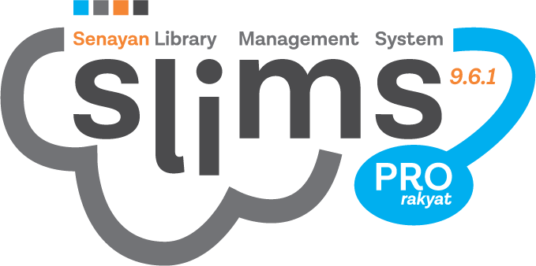

# inSLiMS Template



Template ini merupakan template untuk aplikasi [SLiMS](https://slims.web.id/), sebuah sistem otomasi perpustakaan (Senayan Library Management System).

## Deskripsi

Template ini dirancang untuk memudahkan pengguna SLiMS dalam mengkustomisasi tampilan aplikasi perpustakaan mereka. Template ini adalah portingan dari website lain dan dimodifikasi untuk kompatibilitas dengan SLiMS.

## Fitur Utama

- **Desain Responsif**: Tampil optimal di berbagai perangkat.
- **Mudah Dikustomisasi**: Struktur kode yang mudah dipahami dan dimodifikasi.
- **Kompatibilitas Penuh**: Diuji dan kompatibel dengan versi terbaru SLiMS.

## Instalasi

### Cara 1: Clone dari GitHub

1. Buka terminal Anda.
2. Jalankan perintah berikut:

    ```sh
    git clone https://github.com/idoalit/inSLiMS-template.git
    ```

3. Pindahkan hasil clone ke folder template SLiMS Anda:

    ```sh
    mv inSLiMS-template /path/to/slims/template/
    ```

### Cara 2: Ekstrak dari File ZIP

1. [Download ZIP](https://github.com/idoalit/inSLiMS-template/archive/refs/heads/main.zip) dari repositori.
2. Ekstrak file ZIP tersebut.
3. Pindahkan folder hasil ekstrak ke folder template SLiMS Anda:

    ```sh
    mv inSLiMS-template-main /path/to/slims/template/
    ```

## Penggunaan

1. Setelah template dipasang, buka aplikasi SLiMS Anda dan login sebagai Administrator.
2. Pergi ke menu `System -> Themes`.
3. Pilih template yang baru Anda tambahkan.
4. Terapkan template tersebut.

## Disclaimer

Template ini adalah portingan dari website lain. Semua hak cipta dan hak kekayaan intelektual tetap menjadi milik pemilik aslinya. Kami tidak mengklaim hak atas konten asli, dan hanya menyediakan template ini untuk kemudahan pengguna SLiMS.

## Kontribusi

Kami menerima kontribusi dari siapa pun. Jika Anda ingin berkontribusi, silakan fork repositori ini dan buat pull request dengan perubahan Anda.

## Lisensi

Proyek ini dilisensikan di bawah [GNU General Public License v3.0](LICENSE)

## Kontak

Jika Anda memiliki pertanyaan atau saran, silakan hubungi kami melalui [ido.alit@gmail.com](mailto:ido.alit@gmail.com).

---

Terima kasih telah menggunakan template SLiMS kami! Kami harap ini membantu mempermudah pekerjaan Anda dalam mengelola perpustakaan.
